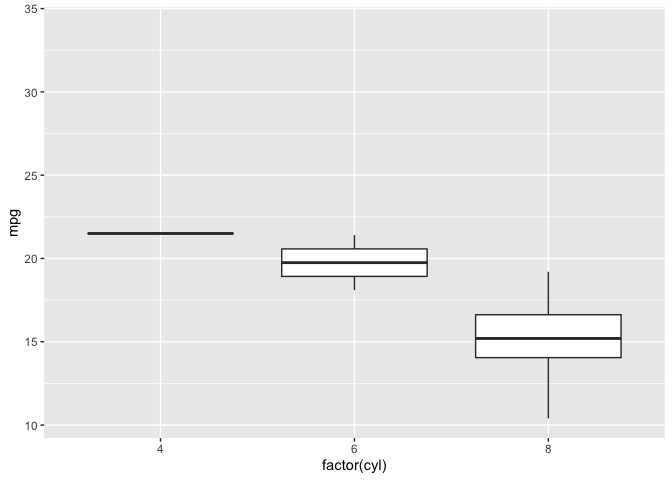
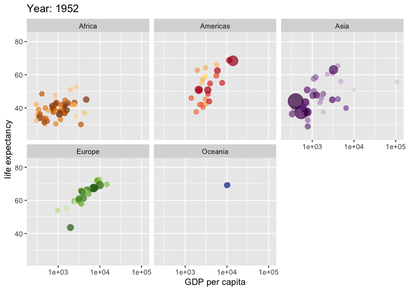

<!-- README.md is generated from README.Rmd. Please edit that file -->
gganimate 
==========================================================

[](https://travis-ci.org/thomasp85/gganimate) [](https://ci.appveyor.com/project/thomasp85/gganimate) [](https://cran.r-project.org/package=gganimate) [](https://cran.r-project.org/package=gganimate) [](https://codecov.io/github/thomasp85/gganimate?branch=master)

`gganimate` extends the grammar of graphics as implemented by [`ggplot2`](https://github.com/tidyverse/ggplot2) to include the description of animation. It does this by providing a range of new grammar classes that can be added to the plot object in order to customise how it should change with time.

-   `transition_*()` defines how the data should be spread out and how it relates to itself across time.
-   `view_*()` defines how the positional scales should change along the animation.
-   `shadow_*()` defines how data from other points in time should be presented in the given point in time.
-   `enter_*()`/`exit_*()` defines how new data should appear and how old data should disappear during the course of the animation.
-   `ease_aes()` defines how different aesthetics should be eased during transitions.

An Example
----------

All of the above might seem a bit abstract. Let's try with a contrived example:

``` r
library(ggplot2)
library(gganimate)

ggplot(mtcars, aes(factor(cyl), mpg)) + 
  geom_boxplot() + 
  # Here comes the gganimate code
  transition_states(
    gear,
    transition_length = 2,
    state_length = 1
  ) +
  enter_fade() + 
  exit_shrink() +
  ease_aes('sine-in-out')
```



Here we take a simple boxplot of fuel consumption as a function of cylinders and lets it transition between the number of gears available in the cars. As this is a discrete split (`gear` being best described as an ordered factor) we use `transition_states` and provides a relative length to use for transition and state view. As not all combinations of data is present there are states missing a box. We define that when a box appears it should fade into view, whereas at should shrink away when it disappear. Lastly we decide to use a sinusoidal easing for all our aesthetics (here, only `y` is changing)

Installation
------------

`gganimate` is currently GitHub-only, but will be released on CRAN once ready. In the meantime, install it using the `devtools` package

``` r
# install.packages('devtools')
devtools::install_github('thomasp85/gganimate')
```

Yet Another Example
-------------------

It is impossible to cover everything possible with `gganimate` in a README, but animations are fun, so let's at least have one more:

``` r
library(gapminder)

ggplot(gapminder, aes(gdpPercap, lifeExp, size = pop, colour = country)) +
  geom_point(alpha = 0.7, show.legend = FALSE) +
  scale_colour_manual(values = country_colors) +
  scale_size(range = c(2, 12)) +
  scale_x_log10() +
  facet_wrap(~continent) +
  # Here comes the gganimate specific bits
  labs(title = 'Year: {frame_time}', x = 'GDP per capita', y = 'life expectancy') +
  transition_time(year) +
  ease_aes('linear')
```



In this example we see the use of `transition_time()` which can be used with continuous variables such as `year`. With this transition it is not necessary to provide transition and state length as the "transition variable" provides this directly (e.g. it should take twice as long to transition between 1980 and 1990 compared to 2000 to 2005). We also see the use of string literal interpolation in titles. `gganimate` lets you specify variables to evaluate inside titles and different transitions provide different type of information to use.

Where is my animation?
----------------------

`gganimate` mimicks the way `ggplot2` renders its output, in that the rendering is done automatically when the `gganim` object is printed. Under the hood, the `animate()` function is called which renders the frame and passes the frames to a renderer functions which takes care of combining them to the final animation. The default renderer is `gifski_renderer()` which returns a `gif_image` object which is a simple wrapper around a path to a gif file. If `animate()` has been called implicetly as part of `print` the `gif_image` object is available using the `last_animation()` function (analogous to `ggplot2::last_plot()`). In order to save the animation to a specific location, you can use the `anim_save()` function which, like `ggplot2::ggsave`, defaults to taking the last rendered animation and writes it to a file.

Old API
-------

This is the second iteration of the gganimate package. The first, developed by [David Robinson](https://github.com/dgrtwo) had a very different API, and relied on specifying animation frame membership inside `aes()` blocks in the `geom_*()` calls. This approach was easy to grasp, but essentially limited in capabilities and has thus been abandoned for a more thorough grammar.

Code written for the old API will not work with this `gganimate` version and there will not come a future support for it. If you wish to continue using the old API then avoid upgrading `gganimate`. If you've already upgraded and wish to downgrade, the latest version of the old API is available as a [GitHub release](https://github.com/thomasp85/gganimate/releases/tag/v0.1.1).

If you wish to convert your old animations to the new API, the closest you get is probably with `transition_manual`, even though it is not completely substitutable:

``` r
# Old code
ggplot(mtcars) + 
  geom_boxplot(aes(factor(cyl), mpg, frame = gear))

# New code
ggplot(mtcars) + 
  geom_boxplot(aes(factor(cyl), mpg)) + 
  transition_manual(gear)
```
